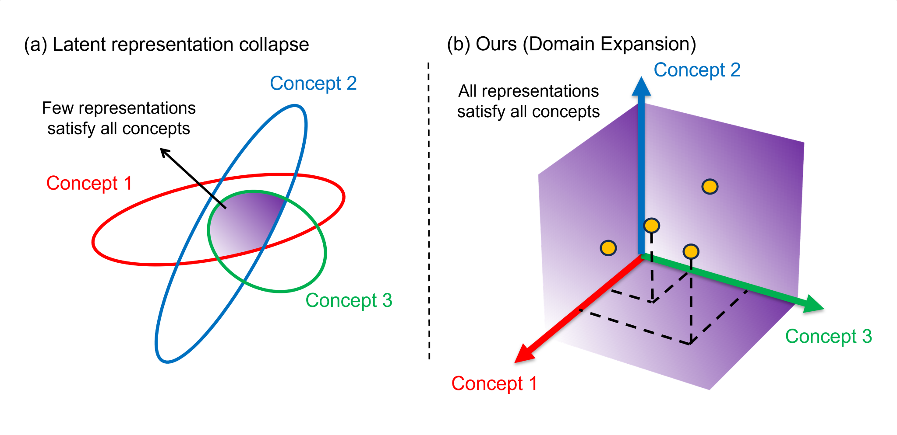

# Domain Expansion: A Latent Space Construction Framework for Multi-Task Learning

**Authors:** Chi-Yao Huang, Khoa Vo, Aayush Atul Verma, Duo Lu, and Yezhou Yang

## Abstract
Training a single network with multiple objectives often leads to conflicting gradients that degrade shared representations, forcing them into a compromised state that is suboptimal for any single task—a problem we term latent representation collapse. We introduce Domain Expansion, a framework that prevents these conflicts by restructuring the latent space itself. Our framework uses a novel orthogonal pooling mechanism to construct a latent space where each objective is assigned to a mutually orthogonal subspace. We validate our approach across diverse benchmarks—including ShapeNet, MPIIGaze, and Rotated MNIST—on challenging multi-objective problems combining classification with pose and gaze estimation. Our experiments demonstrate that this structure not only prevents collapse but also yields an explicit, interpretable, and compositional latent space where concepts can be directly manipulated.

## Main Figure
Here is the central illustration of our method:

(a) **Latent representation collapse**: In standard multi-task learning, competing objectives lead to latent representation collapse, where the solution spaces for different concepts (colored ellipses) overlap in only a small, compromised region.
(b) **Domain Expansion**: In contrast, our method assigns each concept to an orthogonal basis vector in the latent space, preventing interference and creating a structured, interpretable representation where features for each concept are clearly separated.

### 🚧 Work in Progress
**The code for this paper is currently being prepared for release. Please check back soon!**